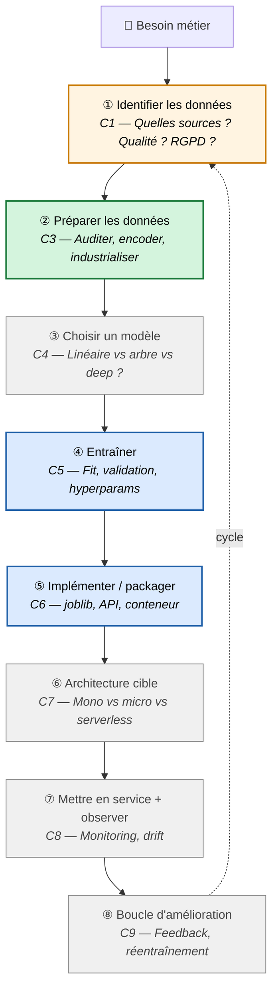
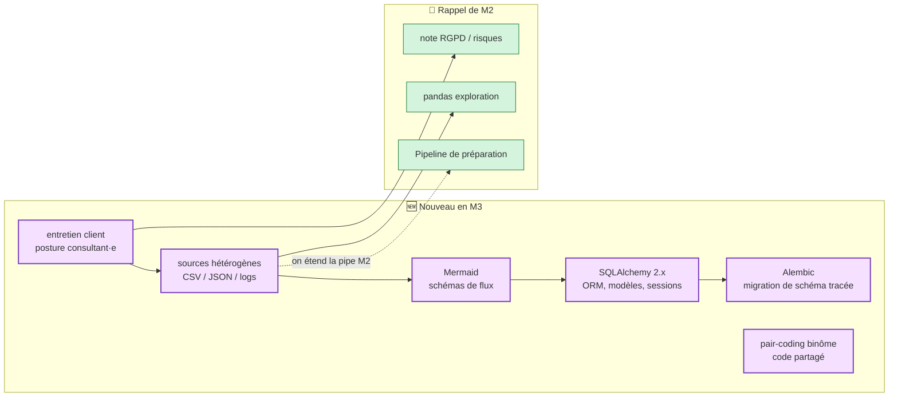

# Récap fin M2 → entrée M3

> Document de pont, à lire entre **mercredi soir M2** et **mardi 9h M3**.
> Objectif : que chacun visualise **où il est arrivé** et **où on va** avant
> de basculer dans M3.
>
> 📍 Lecture cible : **10-15 min**. À avoir sous la main pendant tout M3.

---

## 1. Le cycle ML — où on est dans la grande image

Le référentiel CISIA est organisé autour de **9 compétences** : **8 correspondent
à une étape du cycle** (C1, puis C3→C9, numérotées ① à ⑧ ci-dessous) et **1 est
transversale** (C2, éthique, qui irrigue tout le cycle — d'où l'absence de C2
dans la numérotation). Voici où le parcours t'a mené·e, et ce que **M2 a outillé**.

**Légende** :
- 🟢 **vert** = outillé en M2 (étape 2 — **C3 préparer**, paliers *imiter* puis *adapter*)
- 🟡 **orange** = nouveau en M3 (étape 1 — **C1 identifier les données**, *imiter*)
- 🔵 **bleu** = **déjà acquis** dans les modules passés (C5 entraîner en M1, C6 implémenter en M0-M1)
- ⚪ **gris** = **à venir** dans les futurs modules (C4 en M4, C7 en M7, C8-C9 en M5-M6)
- ↺ le cycle **n'est pas strictement linéaire** : en pratique on revient souvent
  en arrière (un audit de préparation C3 peut révéler qu'il **manque** des
  données → retour en C1). M3 te fait justement **remonter** de C3 vers C1.

> ⚖️ **C2 (risques éthiques)** n'est pas une étape numérotée : c'est une
> compétence **transversale** qui irrigue tout le cycle. Tu l'as démarrée en M2
> (variables sensibles, disparate impact, anonymisation).

> 💡 **La grande bascule M2 → M3** : en M2 on t'a **donné** un dataset (un CSV
> propre) à auditer et préparer. En M3 c'est **toi qui vas chercher la donnée** —
> depuis plusieurs **sources hétérogènes** (CSV, JSON, logs, base de données) —
> et qui fais **évoluer la pipeline** pour les accueillir. Tu remontes encore
> d'un cran **en amont** : tu prends la main sur **ce qui rentre dans le système**.

> 🎯 **Le vrai changement de M3, ce n'est pas une techno — c'est une posture.**
> - De **développeur·se** qui *fait tourner du code* → à **concepteur·trice** qui
>   *conçoit un système de données* et raisonne comme un·e **consultant·e IA**.
> - D'un **fichier** (un CSV propre qu'on te donne) → à un **flux** : la donnée
>   **circule** entre plusieurs composants (sources, base, traitements, doc).
>   Ce n'est plus un tableau, c'est un **système**.
> - De **décisions déjà prises pour toi** (le dataset, les colonnes) → à des
>   **décisions que tu prends et que tu justifies** (quelles sources, quelle
>   qualité, quel schéma). C'est le passage de *« j'applique une méthode »* à
>   *« je conçois et j'argumente »* — exactement ce que vise **C3 au palier
>   ▰▰▰ *transposer***.

---

## 2. Les technos rencontrées en M2 — cartographie par couche

```mermaid
flowchart LR
    subgraph AUDIT["🔍 Audit (M2-B1)"]
        A1[pandas<br/>isna, value_counts, describe]
        A2[disparate impact<br/>règle des 4/5]
        A3[matplotlib / seaborn<br/>4+ visualisations]
    end

    subgraph PREP["🛠️ Préparation (M2-B1)"]
        P1[ColumnTransformer<br/>+ Pipeline]
        P2[OrdinalEncoder<br/>OneHotEncoder]
        P3[SimpleImputer<br/>median / most_frequent]
        P4[joblib + Parquet<br/>persistance]
    end

    subgraph ETHIQUE["⚖️ Éthique avancée (M2-B2)"]
        E1[DI intersectionnel<br/>sex x race]
        E2[spaCy NER + regex<br/>détection PII]
        E3[anonymisation<br/>suppression / hash / mask]
        E4[datasheet Gebru<br/>7 sections]
    end

    subgraph COLLAB["👥 Collaboration (M2-B2)"]
        G1[Git binôme<br/>Co-authored-by, fork]
    end

    A1 --> A2 --> A3 --> P1
    P1 --> P2 --> P3 --> P4
    P4 --> E1 --> E2 --> E3 --> E4
    E4 --> G1

    classDef b1 fill:#e1f5ff,stroke:#0277bd
    classDef b2 fill:#fff4e1,stroke:#c97a00
    class A1,A2,A3,P1,P2,P3,P4 b1
    class E1,E2,E3,E4,G1 b2
```

**Légende** :
- 🔵 **bleu** = vu en M2-B1 (Eckmühl, scoring crédit — German Credit, individuel)
- 🟠 **orange** = ajouté en M2-B2 (Athéna RH, anonymisation — Adult Income, binôme)

### Ce qui arrive en M3 (nouveau)

**Légende** :
- 🟣 **violet** = à découvrir en M3
- 🟢 **vert** = rappel de M2 (à rafraîchir avant lundi soir)

---

## 3. Les compétences — où tu en es, où tu vas

| Code | Compétence (intitulé court) | M1 | M2-B1 | M2-B2 | M3 (à venir) |
| --- | --- | --- | --- | --- | --- |
| **C1** | Identifier les données | — | — | — | **▰▱▱ imiter** |
| **C2** | Identifier les risques éthiques | — | **▰▱▱ imiter** | **▰▰▱ adapter** | ▰▰▱ adapter |
| **C3** | **Préparer les données** | — | **▰▱▱ → ▰▰▱** | **▰▰▱ adapter** | **▰▰▰ transposer** |
| **C4** | Choisir un modèle | — | — | — | — |
| **C5** | Entraîner un modèle | ▰▰▱ | — | — | — |
| **C6** | Implémenter une solution IA | ▰▰▱ | — | — | — |
| **C7** | Concevoir une architecture | — | — | — | — |
| **C8** | Mesurer la performance | — | — | — | — |
| **C9** | Boucle d'amélioration continue | — | — | — | — |

**Lecture** :
- En M2 tu as démarré **C2** (éthique, *imiter* → *adapter*) et fait monter **C3**
  (préparer) de *imiter* à *adapter*.
- En M3 tu démarres **C1** (identifier les données) et **C3 atteint son palier
  final ▰▰▰ *transposer*** : préparer une pipeline dans un contexte nouveau, sans
  modèle imposé.
- C4 (choisir un modèle) arrive en **M4**, C7 en M7, C8-C9 en M5-M6.

> ⚠️ **C'est normal** de n'avoir touché que 2-3 compétences sur 9 à ce stade. La
> progression est **séquentielle et raisonnée** — jamais 9 compétences en
> parallèle.

---

## 4. Vocabulaire — ce que tu manipules maintenant sans hésiter

À l'issue de M2, ces termes devraient être en zone ☀️ *C'est clair* sur ton mur
réflexif. Si **3 ou plus** sont encore en 🌫️ *Flou*, signale-le en RDV vendredi
ou MP Discord avant mardi 9h.

| Famille | Termes |
|---|---|
| **Qualité des données** | manquant déguisé (`value_counts(dropna=False)`), outlier ≠ erreur, doublon, type / modalité |
| **Éthique** | variable sensible, variable **proxy**, biais historique, **disparate impact**, règle des 4/5, **intersectionnalité** |
| **Préparation** | imputation (médiane / mode), **OrdinalEncoder** vs **OneHotEncoder**, biais de représentation, normalisation |
| **Industrialisation** | **`ColumnTransformer`** (les « branches »), `Pipeline`, `joblib`, Parquet vs CSV |
| **RGPD / anonymisation** | PII, NER, pseudonymisation vs anonymisation, suppression / substitution / généralisation / hash |
| **Documentation & collab** | **datasheet** (Gebru, 7 sections), `audit.md` lisible DPO, `Co-authored-by:`, driver / navigator |

---

## 5. Ce que M3 va t'apprendre (anticipation honnête)

À la fin de M3, ces **6 gestes** seront nouveaux :

1. **Mener un entretien client** sur une demande floue, pour distinguer ce qui
   est *demandé* de ce qui est *utile* (1er vrai exercice de posture consultant·e
   — entretien fictif en visio mardi 9h30).
2. **Cartographier des sources hétérogènes** (CSV, JSON, logs texte) : format,
   volume, fraîcheur, qualité, risques RGPD.
3. **Schématiser des flux de données** avec **Mermaid**, lisible par un décideur.
4. **Lire des données depuis une base** avec **SQLAlchemy 2.x** — l'**ORM**
   (manipuler des tables comme des objets Python), plus seulement un CSV.
5. **Faire évoluer un schéma de base** avec une **migration tracée et réversible**
   (Alembic).
6. **Coder en binôme sur du code partagé** (vrai pair-coding, plus loin que le
   duo audit de M2-B2).

> 💡 Les gestes M2 (pandas, Pipeline de préparation, note RGPD) seront **rejoués**
> en M3 — mais sur une pipeline qu'on **fait évoluer**, pas qu'on construit à
> partir d'un CSV propre. C'est la différence fondamentale.

---

## 6. Checklist de transition (à cocher avant mardi 9h M3)

- [ ] J'ai fini mon **audit M2-B1** (audit.md + pipeline + datasheet) — sinon je
      le signale en RDV vendredi.
- [ ] J'ai poussé mon travail d'**anonymisation M2-B2** (branche perso) sur le
      repo binôme.
- [ ] Je sais réexpliquer en 2 min ce qu'est un **disparate impact** et **où je
      divise par quoi**.
- [ ] Je sais dire pourquoi on utilise un **`ColumnTransformer`** plutôt qu'un
      `Pipeline` d'un bloc.
- [ ] J'ai parcouru ce récap et identifié **les 3 termes** les plus flous (à
      pointer en RDV vendredi).
- [ ] J'ai lu le carnet d'entrée M3 (`M3_avant-module.md`) distribué sur Discord
      J-5, et je sais qu'il y a un **entretien client mardi 9h30** (je prépare
      des questions).
- [ ] Mon environnement Python répond au sanity check du carnet M3.

---

## 7. Pour aller plus loin (optionnel, 30 min max)

- **CNIL — pseudonymisation vs anonymisation** :
  <https://www.cnil.fr/fr/lanonymisation-des-donnees-personnelles> — 10 min, pour
  consolider M2-B2.
- **SQLAlchemy 2.0 — *ORM Quick Start*** :
  <https://docs.sqlalchemy.org/en/20/orm/quickstart.html> — 10 min, juste pour
  voir la grammaire `Session` / `select()` avant M3.
- **Mermaid — *Flowchart syntax*** :
  <https://mermaid.js.org/syntax/flowchart.html> — 5 min, l'outil de schémas de M3.
- La **fiche-pattern `fiche_pattern_preparation_donnees.md`** (même dossier) — le
  geste de prépa en 6 étapes, à garder ouvert : il sert encore en M3.

---

*Récap fin M2 → entrée M3 — v1.1, 2026-06-28*